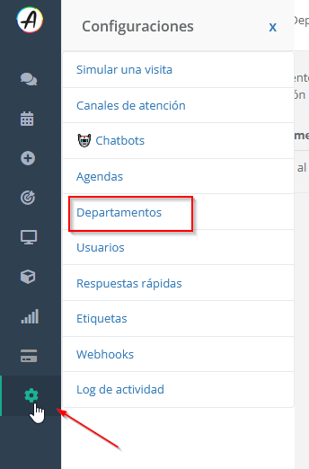
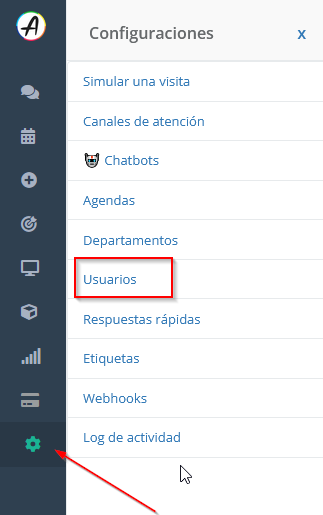
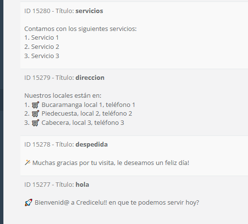

# Configuración Inicial

## Departamentos

- Esta limitado por el plan
- Sirve para agrupar las conversaciones por equipos de trabajo
- Ayuda en la generación de informes sectorizados
- Lo configura el perfil de administrador

## Usuarios

- Cada usuario ingresa a la plataforma con su correo y clave
- Los perfiles se pueden ajustar en todo momento
- Dependiendo del plan se puede usar `Azure Active Directory`

## Respuestas Rápidas

- En configuración -> Respuestas Rápidas
- Ayuda a responder de manera rápida con mensajes pre establecidos
- se pueden crear mensajes con variables usando `{{}}` ejemplo: `Hola {{nombre}} soy {{agente}} el saldo de tu cuenta #{{numero}} es {{monto}}`, de esta manera antes de enviar el mensaje el agente deberá colocar los valores en un formulario automático que se activa antes de enviar el mensaje
- `Las variables {{name}} y {{agent_name}} son variables del sistema que indican el nombre del cliente y el nombre del agente que está respondiendo, respectivamente`

## Plantillas de WhatsApp

- Se utiliza un asistente llamado **Savitar**, la platilla se envia a Meta y cuando ellos la aprueben o no se notifica en la plataforma como un chat

## Canales disponibles

